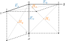

# Simple 2D Python FDTD Solver

## FDTD for electromagnetic fields
A quick explanation of the FDTD discretization and the maxwell equations to bring you up to speed.


An electromagnetic FDTD solver solves the Maxwell Equations

```
    curl(H) = ε ε0 dE/dt
    curl(E) = -µ µ0 dH/dt
```
Where ε and µ are the relative permittivity and permeability tensors respectively. ε0 and µ0 are
the vacuum permittivity and permeability and their square root can be absorbed into E and H respectively.
Doing this, the equations become:
```
    curl(H) = ε/c dE/dt
    curl(E) = -µ/c dH/dt
```


the electric and magnetic field can then be descretized on a grid, which in 3D looks like this:



In 2D, however, this can be written as

| 2D FDTD grid  |   |    |   |
|-:|:-:|:-:|:-|
|   | ⋮ | ⋮  |   |
| ...  | Ez[m,n] | Ey[m,n+½] & Hx[m,n+½] | ...  |
| ...  | Ex[m+½,n] & Hy[m+½,n] | Hz[m+½,n+½] |...   |
|   | ⋮  | ⋮  |   |

Since it is not possible to keep track of half-integer indices, they are not written in
the code and are just implicitly there:

| 2D FDTD grid  |   |    |   |
|-:|:-:|:-:|:-|
|   | ⋮ | ⋮  |   |
| ...  | Ez[m,n] | Ey[m,n] & Hx[m,n] | ...  |
| ...  | Ex[m,n] & Hy[m,n] | Hz[m,n] |...   |
|   | ⋮  | ⋮  |   |

using this discretization, the curl of E can be written as
```
    curl(E)[m,n] = (dEz/dy - dEy/dz, dEx/dz - dEz/dx, dEy/dx - dEx/dy)[m,n]
                 = (dEz/dy, -dEz/dx, dEy/dx - dEx/dy)[m,n]        [2D curl]
                 = ( (Ez[m,n+1]-Ez[m,n])/dy,
                    -(Ez[m+1,n]-Ez[m,n])/dx,
                     (Ey[m,n]-Ey[m-1,n])/dx - (Ex[m,n] - Ex[m,n-1])/dy )
                 = (1/du)*( (Ez[m,n+1]-Ez[m,n]),       [assume dx=dy=dz=du]
                           -(Ez[m+1,n]-Ez[m,n]),
                            (Ey[m,n]-Ey[m-1,n]) - (Ex[m,n] - Ex[m,n-1]) )
```
this can be written efficiently with array slices (note that the factor `(1/du)` was left out):

```python
def curl_E(E):
    curl_E = np.zeros(E.shape)
    curl_E[:, :-1, 0]  =  E[:, 1:, 2] - E[:, :-1, 2]
    curl_E[:, -1, 0]   = -E[:, -1, 2]
    curl_E[:-1, :, 1]  = -E[1:, :, 2] + E[:-1, :, 2]
    curl_E[-1, :, 1]   =  E[-1, :, 2]
    curl_E[:-1, :, 2]  =  E[1:, :, 1] - E[:-1, :, 1]
    curl_E[-1, :, 2]   = -E[-1, :, 1]
    curl_E[:, :-1, 2] -=  E[:, 1:, 0] - E[:, :-1, 0]
    curl_E[:, -1, 2]  -= -E[:, -1, 0]
    return curl_E
```

The curl for H can be obtained in a similar way (note again that the factor `(1/du)` was left out):
```python
def curl_H(H):
    curl_H = np.zeros(H.shape)
    curl_H[:, 1:, 0]  =  H[:, 1:, 2] - H[:, :-1, 2]
    curl_H[:, 0, 0]   =  H[:, 0, 2]
    curl_H[1:, :, 1]  = -(H[1:, :, 2] - H[:-1, :, 2])
    curl_H[0, :, 1]   = -H[0, :, 2]
    curl_H[1:, :, 2]  =  H[1:, :, 1] - H[:-1, :, 1]
    curl_H[0, :, 2]   =  H[0, :, 1]
    curl_H[:, 1:, 2] -=  H[:, 1:, 0] - H[:, :-1, 0]
    curl_H[:, 0, 2]  -=  H[:, 0, 0]
    return curl_H
```

The discretized maxwell equations can now be rewritten as

```
    curl_H/du = ε/c dE/dt
    curl_E/du = -µ/c dH/dt
```

Or written as update equations:
```
    E  += (cdt/du)*inv(ε)*curl_H
    H  -= (cdt/du)*inv(µ)*curl_E
```

The number `(cdt/du)` is a dimensionless parameters called the *courant number*.
For stability reasons, the courant number should always be smaller than `1/√D`, with `D` the
dimension of the simulation. This can be intuitively understoond as being the condition
that the field energy may not transit through more than one mesh cell in a single
time step. This yields the final update equations for the FDTD algorithm:

```
    E  += sc*inv(ε)*curl_H + Es
    H  -= sc*inv(µ)*curl_E + Hs
```

Where `Es` and `Hs` are source terms. This is also how it is implemented in the code:


```python
class Grid:
    # initialization...

    def step(self):
        self.update_E()
        self.source_E()
        self.update_H()
        self.source_H()
        self.timesteps_passed += 1

    def update_E(self):
        self.E += self.courant_number * einsum(
            "ijkl,ijl->ijk", self.inverse_permittivity, curl_H(self.H)
        )

    def update_H(self):
        self.H -= self.courant_number * einsum(
            "ijkl,ijl->ijk", self.inverse_permeability, curl_E(self.E)
        )

    def source_E(self):
        # source implementation here

    def source_H(self):
        # source implementation here
```